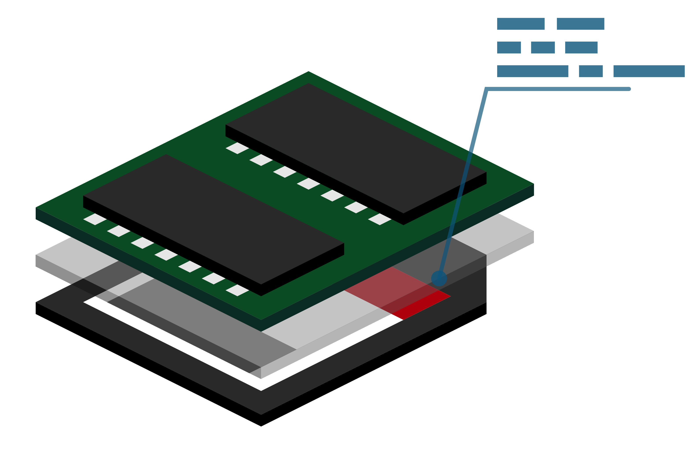

# overlayroot for ArchLinux ARM

<p align="center">

</p>

Mounts an overlay filesystem over the root filesystem, so you can run without losing data on powerloss or wearing out your SD cards. Similar to [fsprotect](https://packages.debian.org/unstable/admin/fsprotect) on Debian.

[](https://travis-ci.org/nils-werner/raspi-overlayroot)

## Background

Most common Linux installations require large parts of the root fileystem to be writable to run services reliably: Logging services create logfiles, other services create temporary config files, some services need a cache they can write to.

However, SD cards like the ones used with Raspberry Pis don't like constantly being written to. They wear out and start to show errors after a few months or years of constantly being written to.

So what one needs in this situation is a file system that can be read-only on the hardware side, but read-write on the operating system side.

OverlayFS can do exactly that: by layering several file systems one can show data from one (the 'lower') filesystem, but have all changes to the data end up in a different (the 'upper') file system. If the lower filesystem is our SD card and the upper filesystem is a temporary filesystem in RAM, we have effectively separated our SD card from all write-attempts of the operating system. Without the operating system even noticing.

If we even mounted the lower filesystem as readonly, it also becomes 100% tolerant to power-losses. You can simply pull the plug to power down your Raspberry Pi.

Using this method I have been running several Raspberry Pi computers for 3+ years nonstop, after which the power supply gave way and had to be replaced. The SD-Card however is still working.

## Installation

### Package

Install this package

```
makepkg -si
```

After installation, a new `initramfs-overlayroot.img` initramfs will be automatically created but not used.
Try rebooting, it should boot as normal.

### Enable overlayroot hook

To enable overlayroot hook, you need to change the `initramfs` command in `/boot/config.txt`:

```
initramfs initramfs-overlayroot.img followkernel
```

Try rebooting, it should boot as normal because there is no `overlayroot` on the commandline yet.

### Enable overlayroot backed on RAM (tmpfs)

To boot with overlayroot over tmpfs, just add `overlayroot=tmpfs` to the end of `/boot/cmdline.txt`.

```
root=/dev/mmcblk0p2 rw rootwait console=ttyAMA0,115200 console=tty1 selinux=0 plymouth.enable=0 smsc95xx.turbo_mode=N dwc_otg.lpm_enable=0 kgdboc=ttyAMA0,115200 elevator=noop overlayroot=tmpfs
```

and reboot. You should see a warning during login that any changes you make to your filesystem will be non-persistent after this point.

### Enable overlayroot backed on USB

To boot with overlayroot backed on USB, just add `overlayroot=<device>` to the end of `/boot/cmdline.txt`. You can specify the device to use by device name or tag, e.g. `/dev/sda2`, `LABEL=ROOT_USB`, `UUID=xxx`, refer to mount(8) manpage for details.

```
root=/dev/mmcblk0p2 rw rootwait console=ttyAMA0,115200 console=tty1 selinux=0 plymouth.enable=0 smsc95xx.turbo_mode=N dwc_otg.lpm_enable=0 kgdboc=ttyAMA0,115200 elevator=noop overlayroot=LABEL=ROOT_USB
```

and reboot. You will not see a warning during login because any changes you make to your filesystem will be stored on the USB device.


### Set filesystems readonly

You can now also set the entire root filesystem as readonly by changing `rw` to `ro` in `/boot/cmdline.txt`

```
root=/dev/mmcblk0p2 ro rootwait console=ttyAMA0,115200 console=tty1 selinux=0 plymouth.enable=0 smsc95xx.turbo_mode=N dwc_otg.lpm_enable=0 kgdboc=ttyAMA0,115200 elevator=noop overlayroot=tmpfs
```

and adding `ro` to `/etc/fstab`

```
#
# /etc/fstab: static file system information
#
# <file system>	<dir>	<type>	<options>	<dump>	<pass>
/dev/mmcblk0p1  /boot   vfat    defaults,ro     0       0
```

## Editing the root filesystem

You can run `rwrootfs` to remount all file systems as read-write and change into an interactive shell in your SD card file system. After exiting that shell, the filesystems will remain read-write until next reboot.

Alternatively you can undo all changes from [Enable overlayroot in commandline](#enable-overlayroot-in-commandline) and [Set filesystems readonly](#set-filesystems-readonly) and reboot. This is the recommended way of system upgrades.

## Resyncing the SDCARD

When using USB backend, you can resync automatically the SDCARD by creating a file named `/overlayroot.resync`. Upon reboot, files (virtually) removed from the SDCARD will be removed from the SDCARD for real and the content of the USB backend will be moved to the SDCARD.

## Debugging

Sometimes, overlayroot may cause trouble during boot time. To boot without it simply remove `overlayroot` from `/boot/cmdline.txt`.

If you still have problems, you can also try removing the initramfs by removing

```
initramfs initramfs-overlayroot.img followkernel
```

from `/boot/config.txt`.
